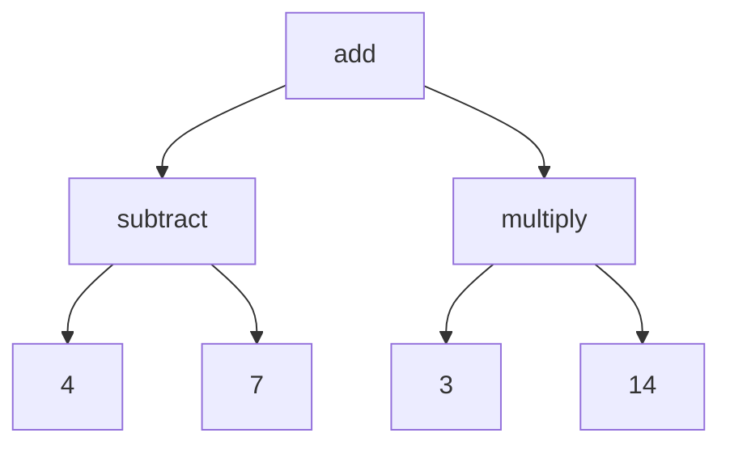
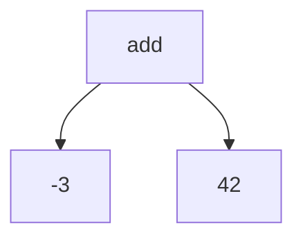

## Compiler vs. Interpreter

Most compilers and interpreters are very similar.

The main difference is that compilers take code in a source format and generate code in a target format.
A C compiler for example takes C code and generates machine code that can be executed by a CPU.
A compiler does **not** need to be installed on the computer that wants to run the code.

An interpreter on the other hand takes code in a source format and executes it.
One example would be Python, which is a interpreted programming language.
Interpreters need to be installed on the computer that wants to run the code.

There are also hybrid approaches like [Just-in-time compilation](https://en.wikipedia.org/wiki/Just-in-time_compilation) (short JIT).
Those are interpreters (need to be installed) that compile parts of the source code piece by piece as it is executed.
Those compiled pieces are then stored and executed.
When a piece is already compiled, it can be executed without compiling it again.

We will go into more detail about the different compilers later.
For now, it is enough to know that there are multiple ways of running code.
We will focus on interpreters for now.

## How to read source code?

The first thing every kind of compiler/interpreter does is to read the source code.
There are two main ways of doing this:

- Abstract Syntax Tree (AST)
- Sea of Nodes

The Sea of Nodes is a more advanced way we will cover in a later chapter.

The AST approach is slower but easier to understand and more versatile.
This method has two parts:

### Lexical Analysis / Tokenization

This is just a fancy name for taking a long list of characters and grouping them together.

The source code is a list of characters.
To group those characters together, we need to define a set of rules, how groups are formed.

Most programming languages split by whitespace (space, tab, newline, etc.).
Let's take a look at this with a simple example for Math:

import LexerVisualization from "../../../components/preact/lexer-visualization.tsx";

We can build tokens while reading the source code.
When we encounter a number, we append it to the current token.
When we encounter a space, we store the token we built so far and start a new one.

<LexerVisualization
	client:load
	input="42 - 37 * 103"
	steps={[
		{ currentIndex: -1, currentChar: "", tokens: [], currentToken: "" },
		{ currentIndex: 0, currentChar: "4", tokens: [], currentToken: "4" },
		{
			currentIndex: 1,
			currentChar: "2",
			tokens: [],
			currentToken: "42",
		},
		{
			currentIndex: 2,
			currentChar: " ",
			tokens: [{ type: "NUMBER", value: "42" }],
			currentToken: "",
		},
		{
			currentIndex: 3,
			currentChar: "-",
			tokens: [
				{ type: "NUMBER", value: "42" },
				{ type: "OPERATOR", value: "-" },
			],
			currentToken: "",
		},
		{
			currentIndex: 4,
			currentChar: " ",
			tokens: [
				{ type: "NUMBER", value: "42" },
				{ type: "OPERATOR", value: "-" },
			],
			currentToken: "",
		},
		{
			currentIndex: 5,
			currentChar: "3",
			tokens: [
				{ type: "NUMBER", value: "42" },
				{ type: "OPERATOR", value: "-" },
			],
			currentToken: "3",
		},
		{
			currentIndex: 6,
			currentChar: "7",
			tokens: [
				{ type: "NUMBER", value: "42" },
				{ type: "OPERATOR", value: "-" },
			],
			currentToken: "37",
		},
		{
			currentIndex: 7,
			currentChar: " ",
			tokens: [
				{ type: "NUMBER", value: "42" },
				{ type: "OPERATOR", value: "-" },
				{ type: "NUMBER", value: "37" },
			],
			currentToken: "",
		},
		{
			currentIndex: 8,
			currentChar: "*",
			tokens: [
				{ type: "NUMBER", value: "42" },
				{ type: "OPERATOR", value: "-" },
				{ type: "NUMBER", value: "37" },
				{ type: "OPERATOR", value: "*" },
			],
			currentToken: "",
		},
		{
			currentIndex: 9,
			currentChar: " ",
			tokens: [
				{ type: "NUMBER", value: "42" },
				{ type: "OPERATOR", value: "-" },
				{ type: "NUMBER", value: "37" },
				{ type: "OPERATOR", value: "*" },
			],
			currentToken: "",
		},
		{
			currentIndex: 10,
			currentChar: "1",
			tokens: [
				{ type: "NUMBER", value: "42" },
				{ type: "OPERATOR", value: "-" },
				{ type: "NUMBER", value: "37" },
				{ type: "OPERATOR", value: "*" },
			],
			currentToken: "1",
		},
		{
			currentIndex: 11,
			currentChar: "0",
			tokens: [
				{ type: "NUMBER", value: "42" },
				{ type: "OPERATOR", value: "-" },
				{ type: "NUMBER", value: "37" },
				{ type: "OPERATOR", value: "*" },
			],
			currentToken: "10",
		},
		{
			currentIndex: 12,
			currentChar: "3",
			tokens: [
				{ type: "NUMBER", value: "42" },
				{ type: "OPERATOR", value: "-" },
				{ type: "NUMBER", value: "37" },
				{ type: "OPERATOR", value: "*" },
			],
			currentToken: "103",
		},
		{
			currentIndex: 13,
			currentChar: null,
			tokens: [
				{ type: "NUMBER", value: "42" },
				{ type: "OPERATOR", value: "-" },
				{ type: "NUMBER", value: "37" },
				{ type: "OPERATOR", value: "*" },
				{ type: "NUMBER", value: "103" },
			],
			currentToken: "",
		},
	]}
/>

The "split by space" rule works for this case, because there is a space between each token.
But it's not always like this.
Someone might write the same expression like this: `42- 37 *103`.

In this case, we would get wrong tokens: `42-`, `37`, `*103`.
This makes no sense, right?

For us humans, it's easy to understand the expression, even though it's not formatted well.
We know that an operator like `*` can never be part of a number.
We need to teach our lexer to do the same.

We need to split when we encounter a space, but also when we encounter a operator.

<LexerVisualization
	client:load
	input="42- 37 *103"
	steps={[
		{ currentIndex: -1, currentChar: "", tokens: [], currentToken: "" },
		{ currentIndex: 0, currentChar: "4", tokens: [], currentToken: "4" },
		{
			currentIndex: 1,
			currentChar: "2",
			tokens: [],
			currentToken: "42",
		},
		{
			currentIndex: 2,
			currentChar: "-",
			tokens: [
				{ type: "NUMBER", value: "42" },
				{ type: "OPERATOR", value: "-" },
			],
			currentToken: "",
		},
		{
			currentIndex: 3,
			currentChar: " ",
			tokens: [
				{ type: "NUMBER", value: "42" },
				{ type: "OPERATOR", value: "-" },
			],
			currentToken: "",
		},
		{
			currentIndex: 4,
			currentChar: "3",
			tokens: [
				{ type: "NUMBER", value: "42" },
				{ type: "OPERATOR", value: "-" },
			],
			currentToken: "3",
		},
		{
			currentIndex: 5,
			currentChar: "7",
			tokens: [
				{ type: "NUMBER", value: "42" },
				{ type: "OPERATOR", value: "-" },
			],
			currentToken: "37",
		},
		{
			currentIndex: 6,
			currentChar: " ",
			tokens: [
				{ type: "NUMBER", value: "42" },
				{ type: "OPERATOR", value: "-" },
				{ type: "NUMBER", value: "37" },
			],
			currentToken: "",
		},
		{
			currentIndex: 7,
			currentChar: "*",
			tokens: [
				{ type: "NUMBER", value: "42" },
				{ type: "OPERATOR", value: "-" },
				{ type: "NUMBER", value: "37" },
				{ type: "OPERATOR", value: "*" },
			],
			currentToken: "",
		},
		{
			currentIndex: 8,
			currentChar: "1",
			tokens: [
				{ type: "NUMBER", value: "42" },
				{ type: "OPERATOR", value: "-" },
				{ type: "NUMBER", value: "37" },
				{ type: "OPERATOR", value: "*" },
			],
			currentToken: "1",
		},
		{
			currentIndex: 9,
			currentChar: "0",
			tokens: [
				{ type: "NUMBER", value: "42" },
				{ type: "OPERATOR", value: "-" },
				{ type: "NUMBER", value: "37" },
				{ type: "OPERATOR", value: "*" },
			],
			currentToken: "10",
		},
		{
			currentIndex: 10,
			currentChar: "3",
			tokens: [
				{ type: "NUMBER", value: "42" },
				{ type: "OPERATOR", value: "-" },
				{ type: "NUMBER", value: "37" },
				{ type: "OPERATOR", value: "*" },
			],
			currentToken: "103",
		},
		{
			currentIndex: 11,
			currentChar: null,
			tokens: [
				{ type: "NUMBER", value: "42" },
				{ type: "OPERATOR", value: "-" },
				{ type: "NUMBER", value: "37" },
				{ type: "OPERATOR", value: "*" },
				{ type: "NUMBER", value: "103" },
			],
			currentToken: "",
		},
	]}
/>

### Parsing

The next step is to take the tokens and build an AST.

This is where the grammar comes into play.
We need rules that define how the tokens can be combined to form a valid expression.

We also need to define a order in which the rules need to be applied.
For example, in math, we need to do multiplication and division before addition and subtraction.

You can also define if `4 3` is valid (`4 * 3`) or invalid (missing operator between two numbers).

The expected AST for `4 - 7 + 3 * 14` would look like this:

To build the AST, you need to iterate over the tokens and push them into a tree.

You can build sub-trees.
This would be one way of handling the order of operations.
First, build sub-trees for multiplications and divisions.
Then, combine those sub-trees into one tree by joining them with additions and subtractions.

### Running the AST

This is where the interpreter differs from a compiler.
The interpreter needs to run the AST.

(We could also compile the AST into machine code and run that. It would still be an interpreter.)

The AST is a tree (as the name suggests).
It has a root node.

We start with the root node and run it.
The root node is an addition node.
It runs its left and right child nodes and adds their numeric values together.

This implies the execution of the subtraction- and the multiplication-nodes.
They are required to get the numeric values for those nodes.

The subtraction node takes its left and right child nodes and subtracts the right child from the left child.
Since 4 and 7 are already numeric values, we can subtract them directly.
The multiplication node takes its left and right child nodes and multiplies them together.
Since 3 and 14 are also numeric values, we can multiply them directly.

Now the addition node can be completed.

## Task

Implement this interpreter for mathematical expressions.

You need to at least support addition, subtraction, multiplication, and division.
You can add more operators or brackets if you want.
