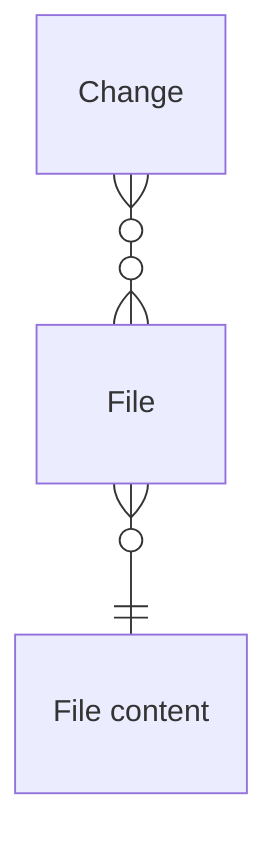
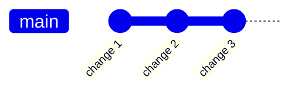
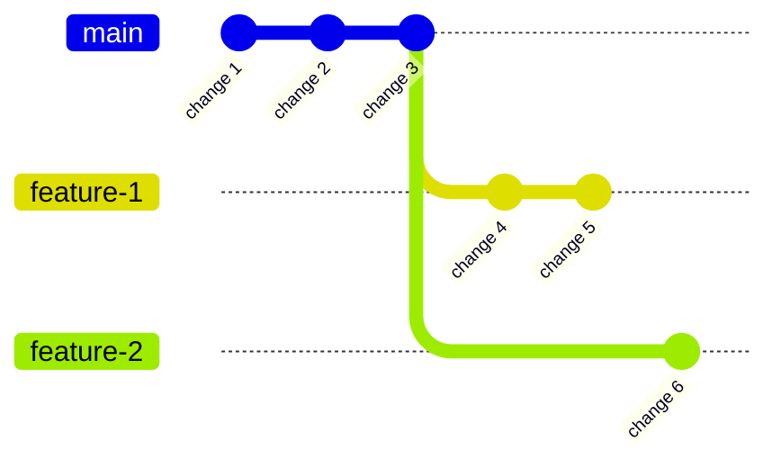
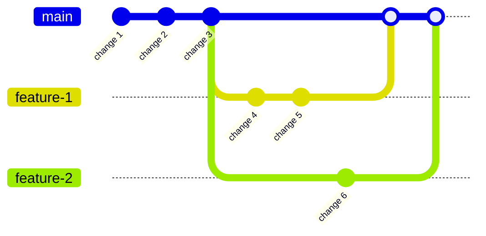
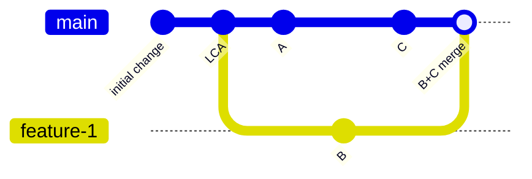

A version control system (VCS) is a tool that is used to keep track of the changes made to a project over time, allowing you to revert to previous versions of the project, compare changes, and collaborate with others.

It is used by developers, but also by engineers, artists, and more.

There are different types of VCSs for different purposes.

Different VCSs use different terminology. For example, Git uses the term "commit" to refer to a change (point in time in the history of a project), while Mercurial uses "changeset". However, the concepts are the same.

## The Origin of Git

Git is currently the default version control for the vast majority of projects, so let's talk about it.

Until 2005, the Linux kernel project, one of the largest open-source projects in the world, used a proprietary, distributed version control system (VCS) called [BitKeeper](https://www.bitkeeper.org/). However, the license for free use for the kernel team was revoked. This created an acute problem: a new VCS was needed that could meet the project's extreme requirements:

- Distributed: Thousands of developers worldwide had to be able to collaborate efficiently.
- Performant: Operations like branching and merging had to be extremely fast.
- Secure: The integrity of the vast code repository had to be guaranteed at all times.

Since no existing solution met these criteria, Linus Torvalds, the initiator of Linux, took matters into his own hands.

Within a few weeks, Linus Torvalds developed the core of Git. His goal was not to create a user-friendly system, but an extremely fast and robust foundation. The first version was minimalistic, consisting of simple command-line tools that already implemented the core principles of Git.

Linus Torvalds' main interest remained the Linux kernel. After laying the foundation for Git, he handed over the project in July 2005 to Junio C Hamano, one of the earliest and most important contributors.

Under Hamano's leadership, Git became what we know today.

Git's real breakthrough with the general public came with the rise of code-hosting platforms, also known as "forges."

These platforms extend pure version control with crucial collaboration features:

- GitHub (2008): Made Git accessible through a graphical interface and popularized the "Pull Request" workflow, which is now the standard for open-source collaboration.
- GitLab (2011): Positioned itself as a "complete DevOps platform" and, in addition to code hosting, offers integrated CI/CD pipelines, issue tracking, and more. GitLab is very popular both as a SaaS and as a self-hosted solution.
- Gitea, Bitbucket, etc.: There are many other players. Gitea is a popular, lightweight self-hosted alternative to GitHub.

## More than just Git

Both before and after Git, there have been many other VCSs.

- [Perforce Helix Core](https://www.perforce.com/products/helix-core) (1995): A commercial, centralized VCS distinguished by high performance in large mono-repositories and fine-grained access control. It is widely used for video games.
- [Subversion](https://subversion.apache.org/) (SVN, 2000): A centralized VCS from the Apache Software Foundation that versions directories and files, developed as a successor to [CVS](https://savannah.nongnu.org/projects/cvs). It is rarely used anymore.
- [Mercurial](https://www.mercurial-scm.org/) (2005): A distributed VCS written in Python, emphasizing simplicity, speed, and consistency of the command-line interface. It is rarely used anymore, except at Meta.
- [Fossil](https://fossil-scm.org/) (2007): An integrated system implemented in C by D. Richard Hipp (author of SQLite) with a built-in bug tracker, wiki, and web interface in a single program. The entire repository is stored in a single SQLite database. It is rarely used, except for SQLite.
- [Pijul](https://pijul.org/) (2014): An experimental, distributed VCS in Rust, based on the theory of patches, aiming for simpler merges and better formal correctness. It is rarely used.
- [Sapling](https://sapling-scm.com/) (2022): Sapling SCM is a cross-platform, highly scalable, Git-compatible source control system developed and used internally at Meta, designed to prioritize usability and scalability for large codebases. It is particularly optimized for handling repositories with tens of millions of files, commits, and branches, making it suitable for massive monorepos.
- [Jujutsu](https://jj-vcs.github.io/jj/latest/) (2023): A distributed, Git-compatible VCS in Rust, initiated by Martin von Zweigbergk (Google), with a focus on more intuitive history editing and advanced merge strategies. It is actively used in some Git repositories. However, exact user numbers are difficult to determine due to its Git compatibility.

## Changes

Many believe that Git only stores the modifications from one change to the next. Almost no VCS does this because it is inefficient.

Most VCSs store snapshots. This is a list of all files contained in a change. A file in Git has a name (e.g. `foo/bar.txt`), an executable flag, and content. Thus, all files are stored in every change, not just those that have changed. Furthermore, it does not matter how much a file has changed; it is saved completely anew.

However, there is an important optimization: it constantly happens that a file's content appears multiple times. If a file is not modified in a change, its entire content does not need to be saved a second time. Likewise, if two files have the same content, it only needs to be stored once.

In short:

- A change is a snapshot of the project at a point in time.
- A change references multiple files.
- Multiple changes can reference the same file.
- A file has a name (path), an executable flag.
- A file references its content.
- Multiple files can reference the same content.

## History

Most VCSs store history as a graph. Each node in the graph is a change.

## Branches

When multiple people work on the same project, it is common to have different branches.

A branch is a split in the history. It's like a parallel universe.
This is used to work on different features at the same time without them interfering with each other.

When a feature is finished, it can me merged back into the main branch.

## 3-Way Merge

When two changes are merged, the VCS must perform a three-way merge. In this process, the history is treated as a [DAC (Directed Acyclic Graph)](https://en.wikipedia.org/wiki/Directed_acyclic_graph). In a DAC, it is easy to find the [LCA (Lowest Common Ancestor)](https://en.wikipedia.org/wiki/Lowest_common_ancestor). This is the change that is a parent of both changes to be merged and lies deepest in the DAC, meaning it is furthest from the initial change.

This sounds complicated. However, represented graphically, it looks quite simple:

When changes B and C are to be merged, a common base is needed against which the changes from both changes can be compared. This common base is the most recent change that is a parent of both B and C (the LCA).
